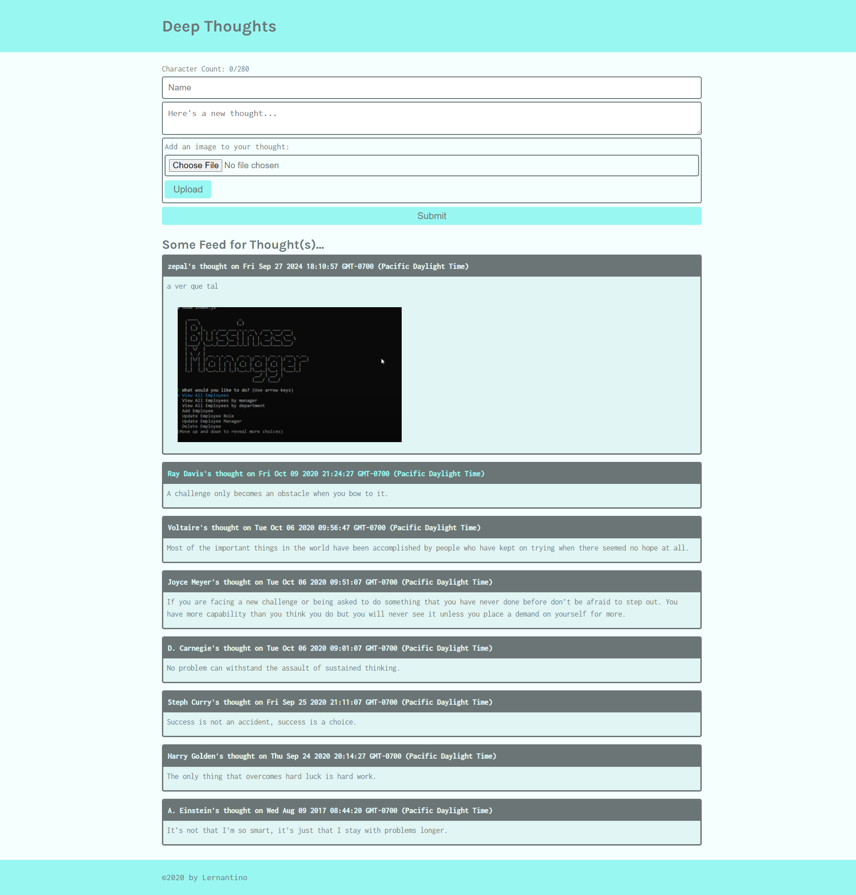

# AWS-THOUGHT

## Description 

This project refactors the Deep Thoughts MERN application to use AWS services for enhanced scalability and performance. DynamoDB replaces MongoDB for database management, providing a serverless, high-performance NoSQL solution. S3 is used for storing and serving static assets, such as images or front-end files, while EC2 hosts the backend and client applications. By leveraging these AWS services, the application gains cloud-native capabilities, improving reliability, reducing operational complexity, and supporting greater scalability for future growth.

## Instalation

N/A

## Usage

To use this app, follow the link to the deployed site, which will direct you to the homepage of Deep Thoughts. There, you'll find a form for creating new posts along with a list of all thoughts shared by users. To create a new post, simply enter your name and your thought, ensuring it stays within the 280-character limit. You also have the option to upload an image to accompany your thought.In the thoughts list, you can view all thoughts attributed to the same name by clicking on it. This action will take you to a profile view, showcasing all thoughts associated with that user.

## Screenshot displaying the deployed app

## URL to the deployed app

[http://3.144.176.99/](http://3.144.176.99/)  
This deployment is for demonstration purposes only. The EC2 instance will be decommissioned shortly due to cost constraints.

## Credits

N/A

## License

MIT License

Copyright (c) 2024 fabricioGuac

Permission is hereby granted, free of charge, to any person obtaining a copy
of this software and associated documentation files (the "Software"), to deal
in the Software without restriction, including without limitation the rights
to use, copy, modify, merge, publish, distribute, sublicense, and/or sell
copies of the Software, and to permit persons to whom the Software is
furnished to do so, subject to the following conditions:

The above copyright notice and this permission notice shall be included in all
copies or substantial portions of the Software.

THE SOFTWARE IS PROVIDED "AS IS", WITHOUT WARRANTY OF ANY KIND, EXPRESS OR
IMPLIED, INCLUDING BUT NOT LIMITED TO THE WARRANTIES OF MERCHANTABILITY,
FITNESS FOR A PARTICULAR PURPOSE AND NONINFRINGEMENT. IN NO EVENT SHALL THE
AUTHORS OR COPYRIGHT HOLDERS BE LIABLE FOR ANY CLAIM, DAMAGES OR OTHER
LIABILITY, WHETHER IN AN ACTION OF CONTRACT, TORT OR OTHERWISE, ARISING FROM,
OUT OF OR IN CONNECTION WITH THE SOFTWARE OR THE USE OR OTHER DEALINGS IN THE
SOFTWARE.
